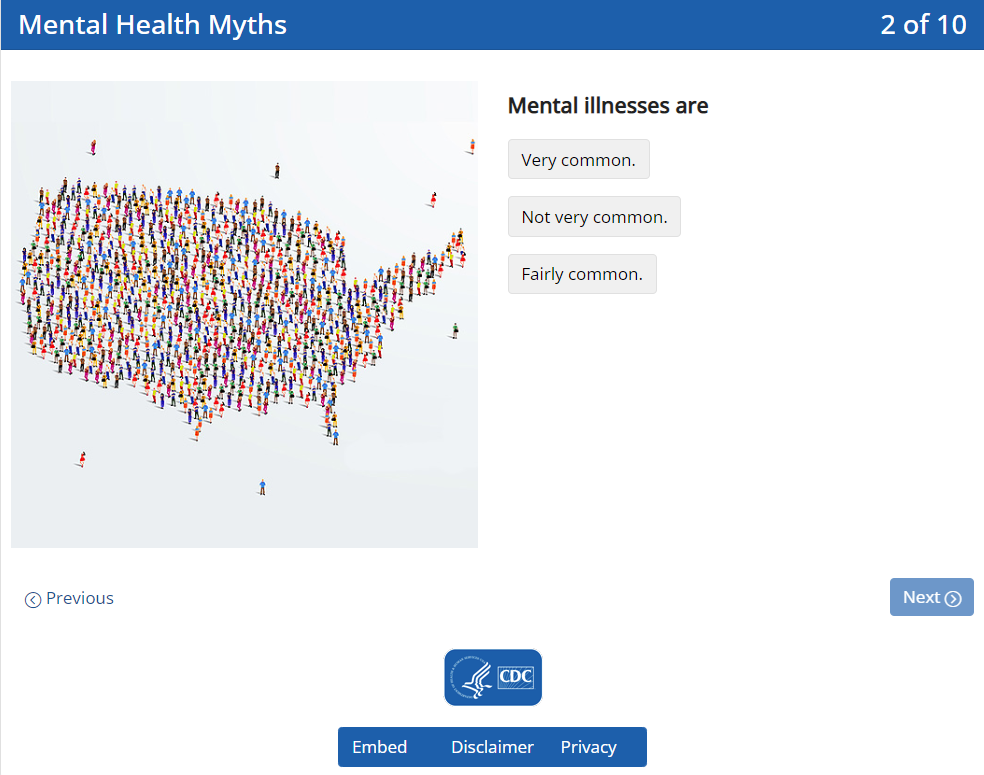

<strong>Welcome to Our Project for P8105!</strong>

---

| {width=300, height=300} | {width=300, height=300} | {width=300, height=300} |
|:----------------------------------------:| :---------------------------------------:| :---------------------------------------:| 
| [Motivation](#motivation) | [Quiz](#quiz) | [Data Source](project_report.html) |
| [{width=300, height=300}](project_report.html)| [{width=300, height=300}](analysis/project_report.html) |[{width=300, height=300}](analysis/project_report.html)|
| [4](analysis/project_report.html) | [5](project_report.html) | [Our Team](#team) |

---

# Motivation {#motivation}

Mental health is an important part of overall health and well-being. Mental health includes our emotional, psychological, and social well-being. Mental health problems exist frequently throughout the United States. About one in five adults suffer from a diagnosable mental illness in a given year. Many common mental illnesses, such as depression, anxiety, bipolar disorder, may increase risk of suicide.

**So...**

* What is the general status of mental illness across states in the US?
* What is the overall trend of the percentage, frequency and level of anxiety and depression in the US across years?
* How do trends in anxiety and depression percentages differ by biological sex, household income, marital status, and age?
* What is the overall suicide trend across years? How does suicide differ by state, age, sex and means?
* What is the association between taking depression or anxious medication and COVID-19 exposure? 

# Mental Health Quiz {#quiz}

There are still many harmful attitudes and misunderstandings around mental illness, which may make people ignore their mental health, fuel stigma, and make it harder to reach out for help. Take the following quiz and see if you can separate the myths from the facts.

  [{length=650 width=800}](https://www.cdc.gov/mentalhealth/quiz/index.htm)

Let's begin with the general status of [mental illness](mental_illness.html)!

# Our Team {#team}

|[Fei Xiao](https://github.com/xiaof2) |[Kelly Luo](https://github.com/KellyLuo233)  |[Tongtong Zhu](https://github.com/TongtongZhu12) |[Yi Fang](https://github.com/yifang2605)   |[Yujie Huang](https://github.com/yh3429)|
|:-----------:| :-----:| :----------:|  :----------:|  :----------:| 
| | | | | |

